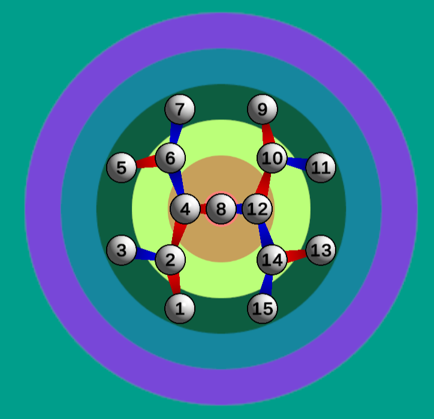

# 🌳 A Game About Binary Trees

A small experimental game designed to **gamify the learning process** of binary trees.

## 🎮 Current Features

This is a very early version — just the bare bones for now:

1. **Radial Binary Search Tree Generation**
   - Each node can have up to **two children**, positioned radially outward from their parent.
   - **Edges** are color-coded:
     - 🔴 **Red** for smaller values (left child)
     - 🔵 **Blue** for larger values (right child)
   - This color scheme reflects how **binary search** works.

2. **Tree Rotations**
   - You can perform standard **left** and **right rotations** to balance the tree, just like in AVL trees.

3. **The Goal (for now)**
   - Make the tree **balanced**, using as **few rotations** and as **little time** as possible.
   - A tree is considered **well-balanced** if **each node’s children subtrees differ in height by at most 1**.

## 📸 Screenshot

## 🔗 Play the Game

- **Game Page**: [Play it here](https://totallyreal.github.io/Binary-Trees/webgl/)
- **Project Page**: [Main repository site](https://github.com/TotallyReal/Binary-Trees),  [Github Pages site](https://totallyreal.github.io/Binary-Trees/)

## 💬 Feedback

Got ideas or suggestions? I’d love to hear them! This is a small side project — feedback, bugs, or feature requests are welcome.

## 📇 Contact

- **Homepage**: [https://prove-me-wrong.com/](https://prove-me-wrong.com/)
- **Email**: [totallyRealField@gmail.com](mailto:totallyRealField@gmail.com)
- **By**: *Ofir David*

